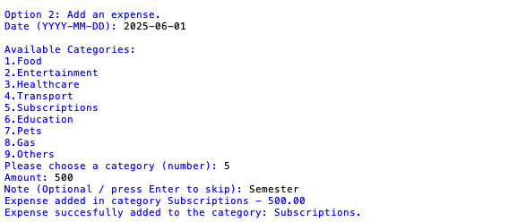
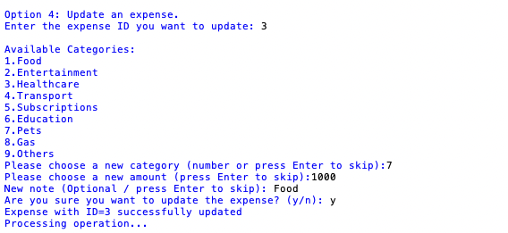

# Expense Tracker Basic

Simple expense tracker built with Python and SQLite. This is the first version that later evolved into CLI and Django App.


--- 

## Technologies & Requirements 
- Python 3.10+
- SQLite3
- logging

## Features
- View all expenses (empty if none).
- Add, edit and delete expenses. 
- Search expenses by category or date range.
- Export expenses to CSV file (Raw or filtered).
- Generate reports by category or date range.

With this you have a simple but complete personal expense tracker. 

## Structure

This version of the Expense Tracker has 5 files:

- main.py: Entry point containing the core logic.
- db.py: This file contains all the database operations in SQLite.
- utils.py: This file contains helper functions to export the selected table to CSV file, and to print the different reports options. 
- logger.py: A basic logger to register the actions made by the project.
- config.py: A list of pre-made categories with the option to be customized by the user. 

---

## Installation

Make sure you have Python 3.10+ and SQLite installed. Clone the repository into a folder and run 'main.py' to use the expense tracker.

```bash
python main.py
```

---

## Usage 

Once the repository is in a folder inside your computer, run 'main.py' and use your keyboard, pressing the number that goes with the action you want to do. 






--- 

## Learned:

- Learned to use SQLite in a real project with persistent storage.  
- Improved handling of imports between project files.  
- Learned to use the Python logging module.  
- Implemented modular design, separating database, logic, configuration, and logging.  
- Practiced file handling with CSV exports.  
- Practiced error handling and debugging.  

---

## License 
This project is licensed under the [MIT License](LICENSE)
© 2025 Yael Tapia.
